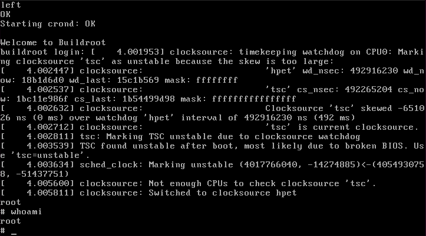

# Custom Linux Distro

---

## Mục lục

1. [Tổng quan](#1-tổng-quan)
2. [Yêu cầu hệ thống](#2-yêu-cầu-hệ-thống)
3. [Cài đặt môi trường](#3-cài-đặt-môi-trường)
4. [Tải và cấu hình Buildroot](#4-tải-và-cấu-hình-buildroot)
5. [Cấu hình Linux Kernel](#5-cấu-hình-linux-kernel)
6. [Tối ưu dung lượng](#6-tối-ưu-dung-lượng)
7. [Biên dịch (Build)](#7-biên-dịch)
8. [Kiểm thử với QEMU](#8-kiểm-thử-với-qemu)
9. [Đóng gói ISO](#9-đóng-gói-iso-sạch)
10. [Cấu hình mạng](#10-cấu-hình-mạng)
11. [Xử lý lỗi thường gặp](#11-xử-lý-lỗi-thường-gặp)
12. [Hướng phát triển tiếp theo](#12-hướng-phát-triển-tiếp-theo)

---

## 1. Tổng quan

Project này xây dựng một bản Linux tối giản CLI từ mã nguồn bằng công cụ **Buildroot**. Hệ điều hành được đóng gói thành file `.iso` có thể:

- Chạy trực tiếp trên RAM (Live CD/USB).
- Hoặc chạy trên ổ cứng.
- Kiểm thử nhanh trên máy ảo QEMU mà không cần phần cứng thật.

### Kiến trúc hệ thống

``` md
Buildroot
├── Toolchain  (musl - thư viện C nhẹ)
├── Kernel     (Linux, phiên bản mới nhất)
├── Userland   (BusyBox - toàn bộ lệnh shell)
└── Output
    ├── bzImage        (Kernel + initramfs)
    ├── rootfs.cpio    (RAM disk)
    └── rootfs.iso9660 (ISO hoàn chỉnh)
```

---

## 2. Yêu cầu hệ thống

| Thành phần | Yêu cầu tối thiểu |
|---|---|
| **Host OS** | Ubuntu 20.04 / Debian 11 trở lên |
| **RAM** | 4 GB |
| **Disk** | Tối thiểu 30 GB trống |
| **CPU** | 2 nhân trở lên |
| **Kết nối mạng** | Bắt buộc |

---

## 3. Cài đặt môi trường

Cập nhật hệ thống và cài đặt các công cụ biên dịch cần thiết:

```bash
sudo apt update
sudo apt install -y \
    build-essential \
    libncurses-dev \
    bc m4 unzip cmake \
    python3 cpio wget rsync \
    libelf-dev \
    qemu-system-x86
```

---

## 4. Tải và cấu hình Buildroot

### 4.1 Tải Buildroot

```bash
wget https://buildroot.org/downloads/buildroot-2025.11.2.tar.gz
tar -xf buildroot-2025.11.2.tar.gz
cd buildroot-2025.11.2
```

Kiểm tra phiên bản mới nhất tại [buildroot.org](https://buildroot.org).

### 4.2 Mở giao diện cấu hình

```bash
make menuconfig
```

### 4.3 Các mục cần cấu hình

#### Target Options

- **Target Architecture:** `x86_64`

#### Toolchain

- **C library:** `musl` *(nhẹ hơn glibc, được tối ưu cho static linking)*
- Bật **Optimize for size** trong `Build options`

#### System configuration

**System hostname:** `TinyLinux` *(tùy chọn)*
**System banner:** `Welcome to Tiny Linux` *(tùy chọn)*
**Init system:** `BusyBox`
**Root password:** *(đặt hoặc để trống)*
**Network interface:**`eth0`

#### Filesystem images

**cpio the root filesystem:** Bật
**Compression method:** `gzip`
**ext2/3/4 root filesystem:** Bật
**initial RAM filesystem linked into linux kernel:** Bật
**iso image:** Bật
**Bootloader:** `isolinux`

#### Bootloaders

- **syslinux:** Bật (bao gồm **isolinux**)

#### Rootfs Overlay

**System configuration -> Root filesystem overlay directories**, nhập:

``` md
board/my_os/rootfs_overlay
```

Buildroot sẽ tự copy toàn bộ nội dung thư mục này đè lên hệ điều hành trước khi đóng gói.

---

## 5. Cấu hình Linux Kernel

```bash
make linux-menuconfig
```

### 5.1 Các tính năng BẮT BUỘC bật

#### Hỗ trợ UEFI

``` md
Processor type and features
  [*] EFI runtime service support
  [*] EFI stub support
```

#### Hỗ trợ PCI và ACPI

``` md
Bus options
  [*] PCI support
  [*] PCI Express (PCIe) support

Power management and ACPI options
  [*] ACPI (Advanced Configuration and Power Interface)
```

#### Hỗ trợ bàn phím USB

``` md
Device Drivers -> HID bus support
  [*] Generic HID driver
  [*] USB HID support

Device Drivers -> USB support
  [*] xHCI HCD (USB 3.0) support
```

#### Hỗ trợ RAM disk

``` md
Filesystem images
  [*] Initial RAM filesystem linked to linux kernel
```

#### Hỗ trợ /dev tự động (devtmpfs)

``` md
Device Drivers -> Generic Driver Options
  [*] Maintain a devtmpfs filesystem to mount at /dev
  [*] Automount devtmpfs at /dev, after the kernel mounted the rootfs
```

#### Hỗ trợ đọc ổ cứng

``` md
Device Drivers -> Serial ATA and Parallel ATA drivers
  [*] AHCI SATA support

Device Drivers → NVME support
  [*] NVM Express block device
```

### 5.2 Các tính năng nên tắt để giảm dung lượng

**Network device support:** Bluetooth không cần thiết
**Sound card support:** Không cần thiết
**Multimedia support:** Không cần thiết
**Graphics support:** Driver đồ họa rất nặng
**LED Support:** Không cần thiết

---

## 6. Tối ưu dung lượng

Áp dụng các kỹ thuật để giảm kích thước file `bzImage`

### 6.1 Cắt tỉa BusyBox

```bash
make busybox-menuconfig
```

Chỉ giữ lại những lệnh thực sự cần thiết:

**Shell:** `ash`
**Cơ bản:** `ls`, `cd`, `cat`, `mkdir`, `rm`, `cp`, `mv`
**Mạng:** `ifconfig`, `udhcpc`, `ping`, `wget`
**Tiện ích:** `vi`, `grep`

### 6.2 Thuật toán nén mạnh hơn

Trong `make menuconfig -> Filesystem images -> Compression method`, đổi sang `xz`:

- Giảm thêm 30–40% dung lượng so với nén `gzip`
- Thời gian boot chậm hơn không đáng kể

---

## 7. Biên dịch

### 7.1 Build

```bash
make             # build đơn giản
make -j$(nproc)  # tận dụng toàn bộ CPU cores
```

> Lần build đầu tiên mất **30–45 phút**. Các lần sau chỉ 1–5 phút vì Buildroot cache lại.

### 7.2 Các lệnh rebuild riêng lẻ

```bash
# Rebuild Kernel
make linux-rebuild

# Rebuild BusyBox
make busybox-rebuild

# Rebuild Bootloader
make syslinux-rebuild

# Rebuild chỉ rootfs CPIO
make rootfs-cpio

# Gộp lại và tạo ISO
make
```

---

## 8. Kiểm thử với QEMU

```bash
qemu-system-x86_64 -cdrom output/images/rootfs.iso9660 -m 512M
```



---

## 9. Đóng gói ISO sạch

### 9.1 Quy trình build sạch

```bash
# Xóa file cũ
rm -rf output/images/*

# Tạo file CPIO placeholder (tránh deadlock)
touch output/images/rootfs.cpio

# Tạo rootfs CPIO thật
make rootfs-cpio

# Rebuild Bootloader
make syslinux-rebuild

# Rebuild Kernel (nhúng CPIO vào)
make linux-rebuild

# Đóng gói ISO hoàn chỉnh
make
```

### 9.2 Kết quả

File đầu ra nằm trong `output/images/`:

| File | Mô tả |
|---|---|
| `bzImage` | Linux Kernel |
| `rootfs.cpio` | Hệ thống file dạng RAM disk |
| `rootfs.ext4` | Hệ thống file dạng ổ cứng |
| `rootfs.iso9660` | Đĩa ISO hoàn chỉnh để boot |

File iso thành phẩm có kích thước 11MB


---

## 10. Cấu hình mạng

```bash
# Bật card mạng
ifconfig eth0 up

# Xin địa chỉ IP qua DHCP
udhcpc -i eth0

# Kiểm tra kết nối (wget thay vì ping vì QEMU chặn ICMP)
wget http://google.com -O /dev/null
```

---

## 11. Xử lý lỗi thường gặp

### 11.1 `fatal error: gelf.h: No such file or directory`

```bash
sudo apt install -y libelf-dev
make 
```

### 11.2 `Kernel panic - VFS: Unable to mount root fs`

Kernel không tìm thấy root filesystem:

- Kiểm tra `output/images/rootfs.cpio` có tồn tại không.
- Trong `make menuconfig`, đảm bảo `[*] initial RAM filesystem linked into linux kernel` được bật.
- Hoặc chạy QEMU với: `-initrd output/images/rootfs.cpio`

### 11.3 `Kernel panic - No working init found`

Nguyên nhân phổ biến nhất: thiếu `devtmpfs` (xem mục 5.1). Kiểm tra trong `make linux-menuconfig` rồi:

```bash
make linux-rebuild && make
```

### 11.4 `No rule to make target rootfs.cpio`

Xảy ra khi đã xóa `output/images/` nhưng Buildroot không tự tạo lại CPIO:

```bash
touch output/images/rootfs.cpio
make rootfs-cpio
make linux-rebuild
make
```

### 11.5 `cannot stat '.../images/syslinux/*': No such file or directory`

Syslinux bị xóa khỏi `output/images/`:

```bash
make syslinux-rebuild
make
```

---

## 12. Hướng phát triển tiếp theo

### Mở rộng sang BSD

| Mục tiêu | Mô tả |
|---|---|
| **OpenBSD bsd.rd** | Giải nén, thêm công cụ bảo mật, đóng gói lại |
| **mfsBSD** | FreeBSD chạy hoàn toàn trên RAM |
| **NanoBSD** | Firmware-style OS cho router/appliance |
| **NetBSD crunchgen** | Gộp toàn bộ công cụ thành 1 binary duy nhất |
